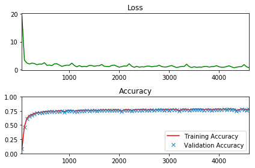

# Raw Tensorflow Neural Network Model Implementation 

This model uses Core Tensorflow to implement Neural network model for classifying letter from different font images 

Final Result:  

There are 2 main parts of this model:

1. **Model**: Raw Tensorflow model implementation

2. **Training & Testing**: Training and testing model with nomnist dataset 

## Datasets

Datasets necessary for this implementation  
[notMNIST training dataset](https://s3.amazonaws.com/udacity-sdc/notMNIST_train.zip)  
[notMNIST testing dataset](https://s3.amazonaws.com/udacity-sdc/notMNIST_test.zip) 

## List of Hyperparameters used:

* Model = **Raw Tensorflow model**
* Batch Size - **128** 
* Epochs - **4**  
* Loss - **Cross Entropy** 
* Optimizer  = **GradientDescentOptimizer**  
* Initial Learning Rate = **0.002**

